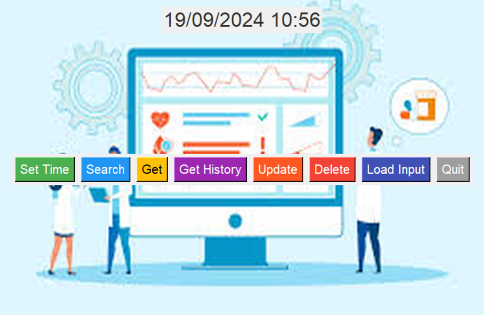

# Temporal Data Maintenance System

This project is a GUI application built using `tkinter` for managing temporal data. The application allows users to perform various operations such as searching, getting, updating, and deleting data, as well as setting the time and loading data from an Excel file.

## Table of Contents
- [Features](#features)
- [Tools](#tools)
## Photo
You can add a photo of the application or its interface here:

## Features
- **Search Data**: Search for data based on first name, last name, and lonic number.
- **Get Data**: Retrieve current data entries.
- **Get History**: Retrieve historical data entries.
- **Update Data**: Add or update data entries.
- **Delete Data**: Delete data entries.
- **Set Time**: Set the current time for the application.
- **Load Input**: Load data from an Excel file.

  ## Tools
  **Python**: The main programming language used for the application.
  **tkinter**: A standard GUI library for Python used to create the graphical user interface.
  **datetime**: A module for manipulating dates and times.
  **unittest.mock**: A library for testing in Python, used to mock objects during unit tests.
  **pytest**: A framework for running tests.
  **pandas**: A library used for data manipulation and analysis (if applicable, for handling Excel files).
  **openpyxl**: A library for reading and writing Excel files (if applicable).
